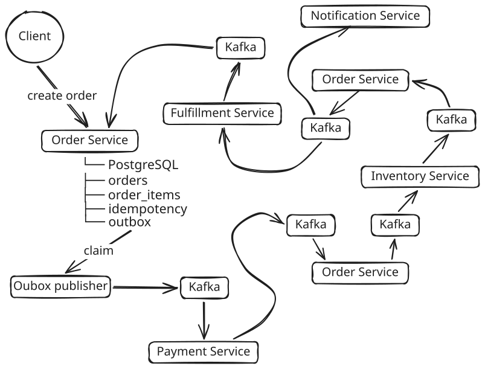

# Order Validation System
A distributed, event-driven backend system for processing customer orders through payment, inventory, fulfillment, and notification workflows with strong consistency guarantees using transactional outbox and idempotency patterns.

      

[Introduction](#introduction) | [Features](#features) | [Tech Stack](#tech-stack) | [Installation](#installation) | [Quick start](#quick-start) | [Usage](#usage) | [Known issues and limitations](#known-issues-and-limitations) | [Getting help](#getting-help) | [Contributing](#contributing) | [License](#license)


## Introduction
This project implements a microservices-based Order Processing System that demonstrates event-driven architecture using Kafka, transactional outbox pattern for reliable message delivery, idempotency at both API and consumer levels and eventual consistency across distributed services.

Roughly the system processes an order through multiple stages: `PENDING -> PAYMENT -> INVENTORY -> FULFILLMENT -> COMPLETED`.




## Features
- REST API for order creation and querying
- Fully event-driven processing pipeline
- Transactional Outbox for reliable event publishing
- Idempotent API and event consumers
- Retry and backoff for failed event processing
- Multi-service architecture with clear boundaries
- Dockerized local environment
- OpenAPI / Swagger documentation


## Tech stack
- Node.js + TypeScript
- PostgreSQL
- Apache Kafka
- Prisma ORM
- Docker & Docker Compose
- Testcontainers


## Installation

### Prerequisites

Docker + Docker Compose

```sh
docker compose up --build
```
This command starts:
- PostgreSQL
- Kafka (KRaft)
- Order Service
- Payment Service
- Inventory Service
- Fulfillment Service
- Notification Service

## Quick start

Execute the docker compose command and create an order:

```sh
curl -X POST "http://127.0.0.1:3001/api/external/v1/orders/create" \
  -H "Content-Type: application/json" \
  -H "Idempotency-Key: 82c412a6-d932-414a-89f0-5f40b1fac1db" \
  -d '{
    "customerId": "67993c38-8059-4d8b-8567-1542560584ee",
    "items": [
      { "sku": "SKU-1", "quantity": 33, "unitPrice": 19.99 },
      { "sku": "SKU-2", "quantity": 14.50, "unitPrice": 25 }
    ],
    "currency": "USD",
    "shippingAddress": {
      "country": "USA",
      "city": "Austin",
      "addressLine1": "Lincoln, 65"
    }
  }'
```

Example response:

```json
{
  "createdAt": "2026-04-01T06:01:29.542Z",
  "currency": "USD",
  "orderId": "480cbbaa-34d2-4b97-ad96-46f0b2ffdb82",
  "status": "PENDING",
  "totalAmount": 44.99
}
```

## Usage


### API endpoints

- `POST /api/v1/orders/create` - creates an order and returns basic information on confirmation.
- `GET /api/v1/orders/{orderId}` - fetch an order status by orderId.
- `GET /api/v1/orders` - list orders with filters (`customerId`, `status`, `page`, `size`).

- `GET /api/utility/liveness` - liveness probe.
- `GET /api/utility/readiness` - readiness probe.

OpenAPI and Swagger UI:

- `GET /docs.json` - raw OpenAPI spec.
- `GET /docs` - Swagger UI.


## Known issues and limitations

- No load or stress testing is included.
- Authentication and authorization are not implemented.
- Monitoring tools are not included.
- No real payment or inventory validation, they are simulated

## Getting help

If you encounter a bug or have a question about the project, please use the repository issue tracker or reach me out directly.


## Contributing

Pull requests are welcome. For substantial changes, please open an issue first to discuss the proposed approach.


## License

This project is licensed under the MIT License. See the `LICENSE` file for details.